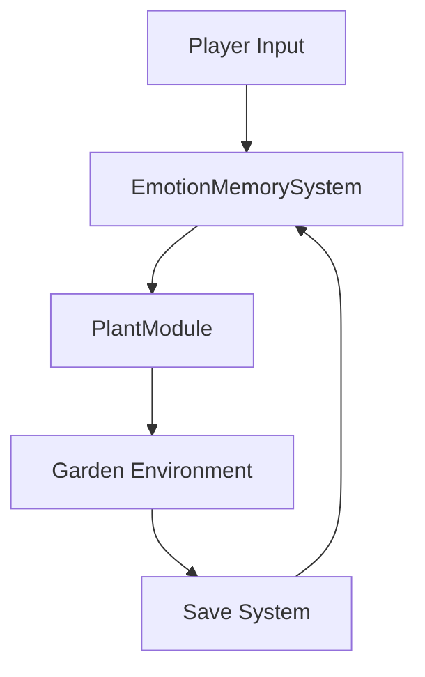

# 🏛️ NeuroBloom Architecture

## System Overview

NeuroBloom is built on a modular architecture that emphasizes emotional resonance, persistence, and real-time interaction. The system is designed to create a deeply personal experience while maintaining performance and scalability.

## Core Systems

### 1. Memory Engine (`EmotionMemorySystem`)
- **Purpose**: Manages player emotional states and memory persistence
- **Components**:
  - DataStore integration for persistence
  - Emotional state tracking
  - Memory fragment system
  - Garden state synchronization

### 2. Plant System (`PlantModule`)
- **Purpose**: Handles plant growth, interactions, and emotional responses
- **Components**:
  - Plant archetype definitions
  - Growth stage management
  - Emotional response system
  - Animation and effect controllers

### 3. Garden Environment (`MainGardenScene`)
- **Purpose**: Creates the immersive garden environment
- **Components**:
  - Biome system
  - Environmental effects
  - Sound system
  - Lighting controller

### 4. Ritual System (`GardenRituals`)
- **Purpose**: Manages daily rituals and player interactions
- **Components**:
  - Ritual scheduling
  - Interaction handlers
  - Progress tracking
  - Reward system

### 5. UI System (`UI_MainMenu`)
- **Purpose**: Provides intuitive user interface
- **Components**:
  - Main menu
  - Garden view
  - Memory viewer
  - Settings panel

### 6. Save System (`GardenSaveSystem`)
- **Purpose**: Manages game state persistence
- **Components**:
  - Auto-save functionality
  - State recovery
  - Data validation
  - Backup system

## Data Flow

## Technical Specifications

### Performance Considerations
- Optimized plant rendering
- Efficient memory management
- Background data processing
- Asset streaming

### Security Measures
- Data encryption
- Input validation
- Rate limiting
- Anti-exploit measures

### Scalability
- Modular design
- Resource pooling
- Dynamic loading
- State management

## Development Guidelines

### Code Organization
- Clear module separation
- Consistent naming conventions
- Comprehensive documentation
- Error handling

### Testing Strategy
- Unit tests
- Integration tests
- Performance benchmarks
- User acceptance testing

## Future Considerations
- Mobile optimization
- Cross-platform support
- Social features
- Analytics integration 